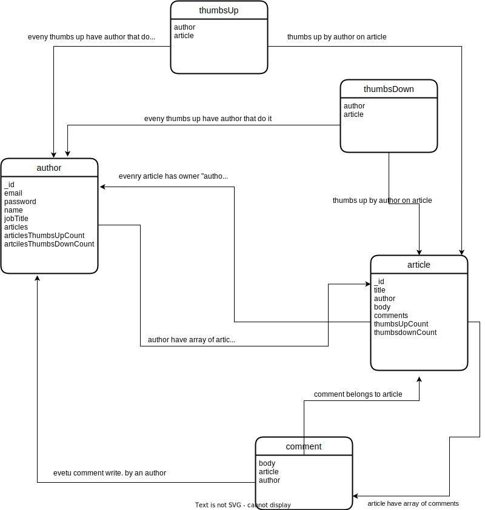

## system design

### db design

- author is system user that can create article, comment in this article and thumbs up/down.
- author have name, email , password, jobTitle and array of article that he write (ref ID to article).
    - but author have also articleThumbsUpCount, and articleThumbsDownCount this is for good performance no need to do any thing if you need to count the thumbs up/down for his/her article. when some one thumbs up/down article => go to his owner and add one to count

* article have title, body  and author that write this article (ref ID to author)
* and have array of comments that write to this article (ref ID to comment)
* and also have thumbs up/down count for good performance
#### so  when one thumbs an article we add one to owner of this article and this article also 

* comment have body, author who write this comment and article that comment belongs to it

* and other two models thumbsDown, thumbsUp have author and article. so when need to get all thumbs by given user we get from this tables, 